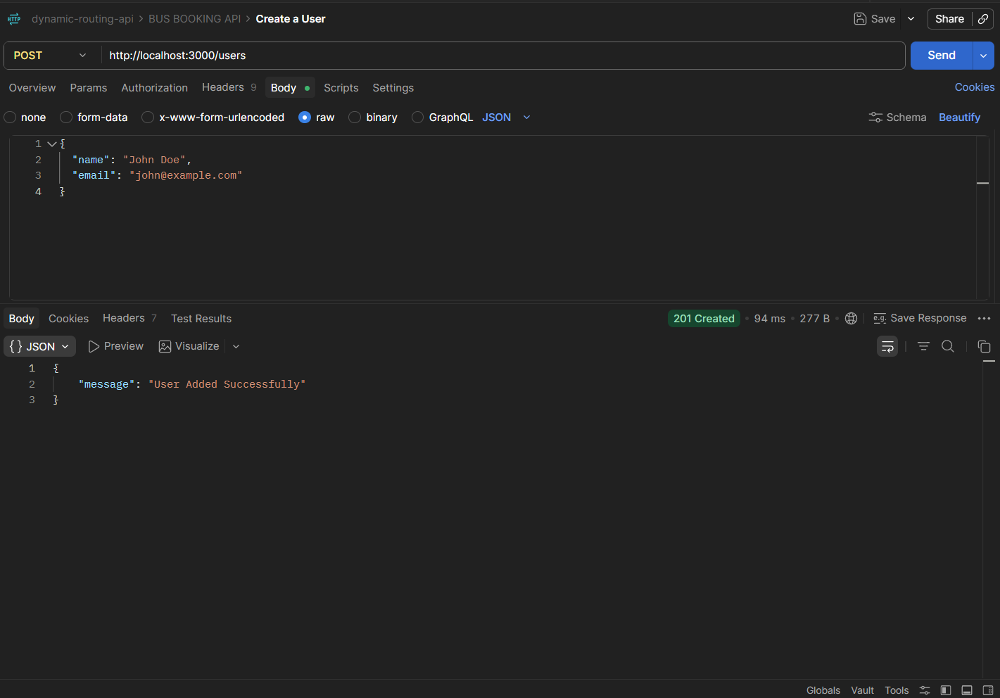
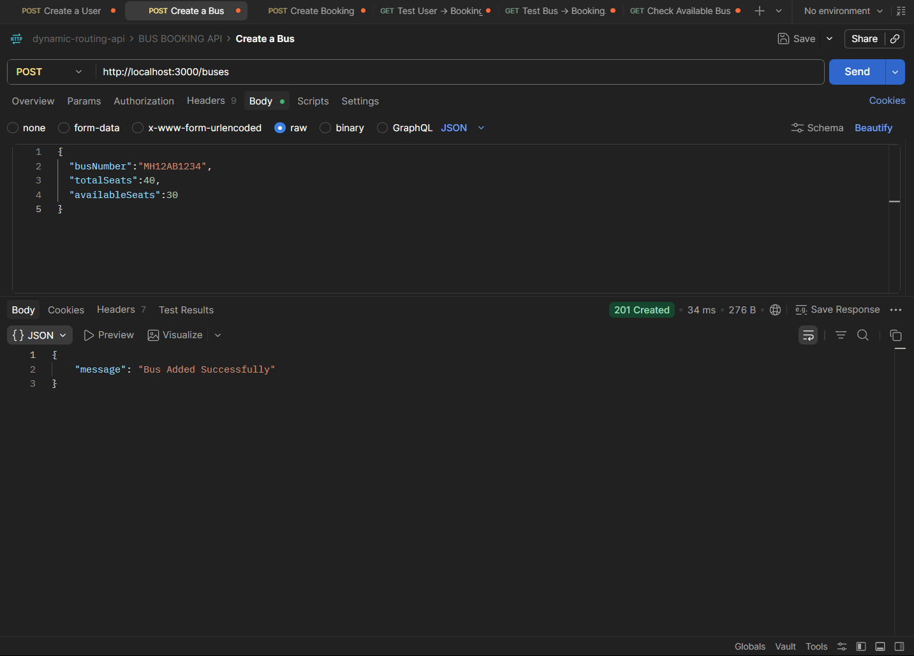
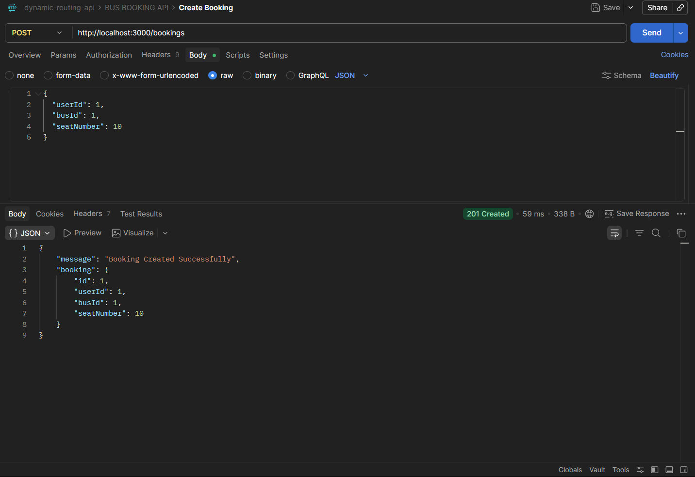
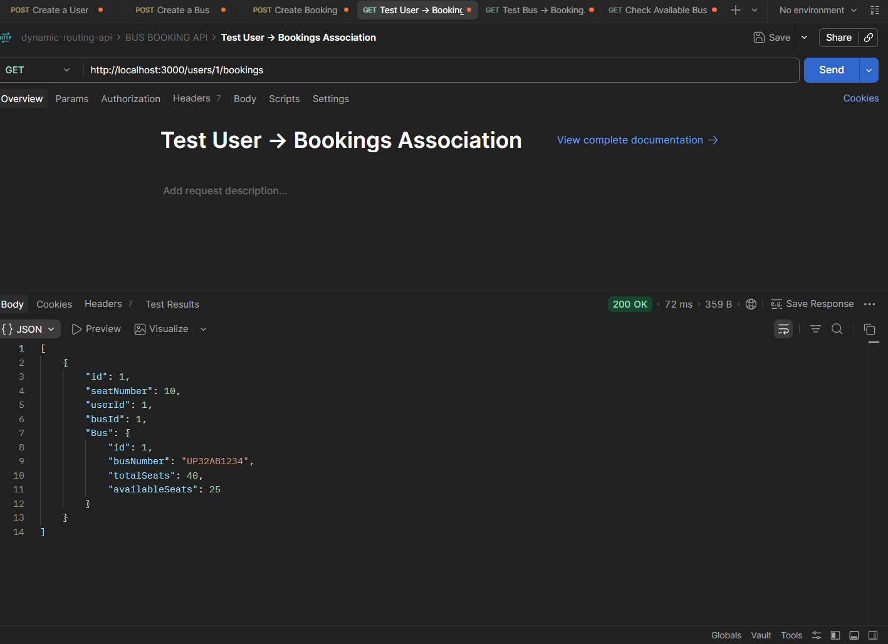
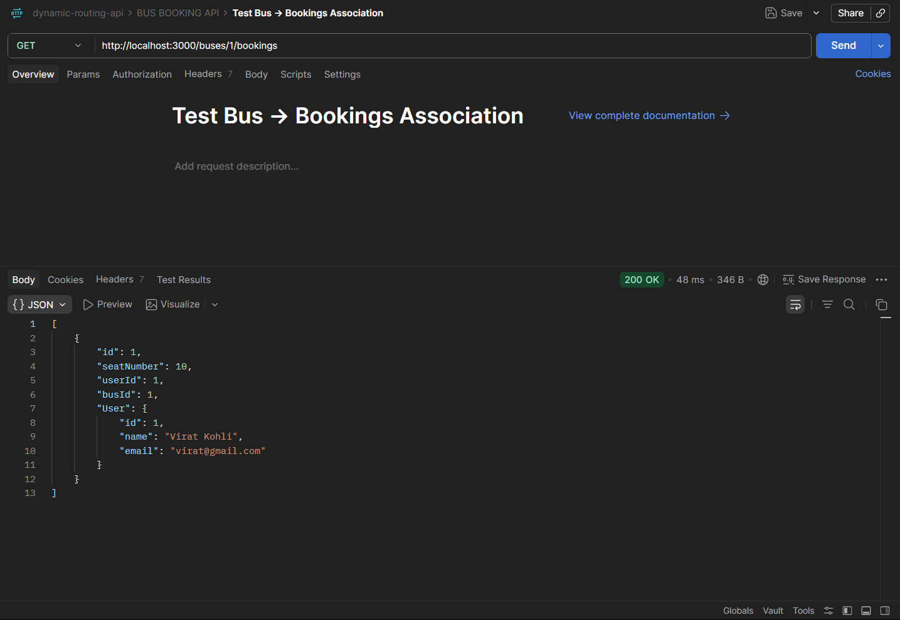
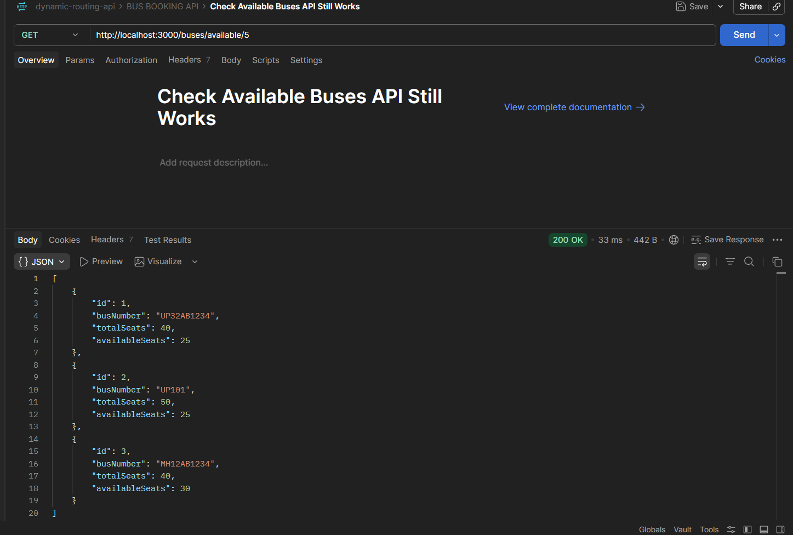
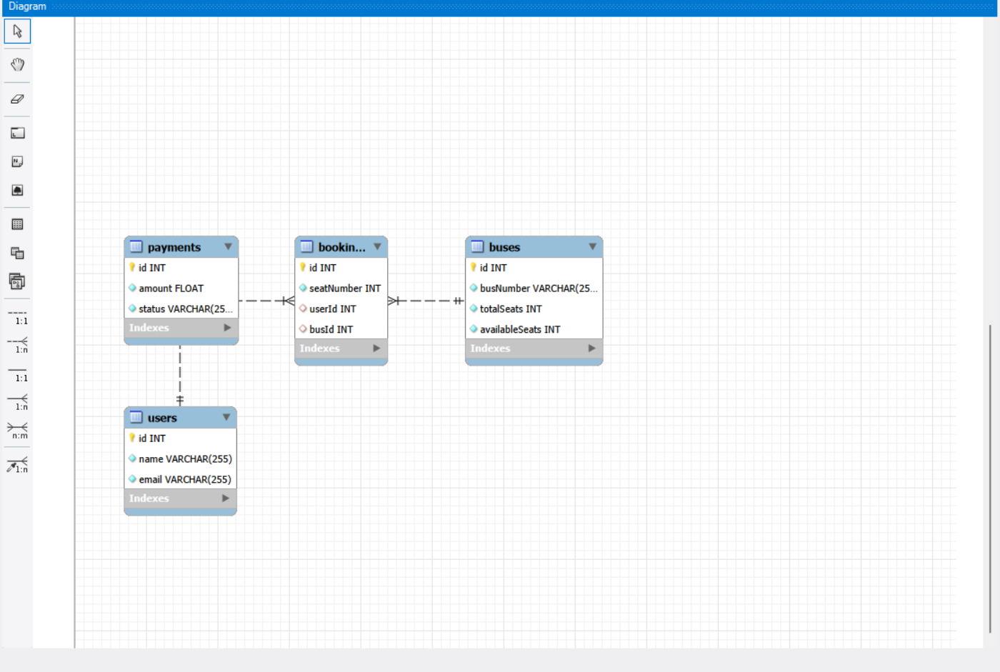

<p align="center">
  <h1 align="center">🚌 Bus Booking System API using Sequelize ORM</h1>
</p>


<p align="center">
  <h3 align="center">RESTful API built with Node.js, Express.js, MySQL & Sequelize ORM</h3>
</p>

<p align="center">
  Manage Users, Buses, Bookings, and Payments using Sequelize ORM with MySQL.
</p>

<p align="center">
  <a href="https://github.com/yashav-shukla">
    
  </a>
</p>

<p align="center">
  
  
  
  
</p>

<p align="center">
  
</p>

---

## 📖 Overview

This project demonstrates Sequelize ORM with MySQL using a clean MVC Architecture.

The application manages:

* 👤 Users
* 🚌 Buses
* 🎫 Bookings
* 💳 Payments

It also demonstrates One-to-Many Associations using Sequelize.

---

## ✨ Features

* 👤 Create Users
* 🚌 Create Buses
* 🎫 Create Bookings
* 📋 Retrieve Users
* 🔎 Filter Available Buses
* 🔗 User ↔ Booking Association
* 🔗 Bus ↔ Booking Association
* 🗄️ Foreign Key Relationships
* ⚡ Sequelize Include Queries
* 📦 Sequelize ORM
* 🛡️ Error Handling
* 📁 MVC Architecture

---

## 🛠 Tech Stack

| Technology    | Purpose              |
| ------------- | -------------------- |
| Node.js       | Runtime Environment  |
| Express.js    | Backend Framework    |
| MySQL         | Relational Database  |
| Sequelize ORM | ORM                  |
| mysql2        | MySQL Driver         |
| JavaScript    | Programming Language |
| Git & GitHub  | Version Control      |

---

## 📂 Project Structure

```text
bus-booking-system-api/
│
├── assets/
│   └── images/
│
├── controllers/
│   ├── userController.js
│   ├── busController.js
│   └── bookingController.js
│
├── models/
│   ├── User.js
│   ├── Bus.js
│   ├── Booking.js
│   ├── Payment.js
│   └── index.js
│
├── routes/
│   ├── userRoutes.js
│   ├── busRoutes.js
│   └── bookingRoutes.js
│
├── utils/
│   └── db.js
│
├── index.js
├── package.json
├── package-lock.json
└── README.md
```

---

## 🔗 Sequelize Associations

### User → Booking (One-to-Many)

```javascript
User.hasMany(Booking);

Booking.belongsTo(User);
```

### Bus → Booking (One-to-Many)

```javascript
Bus.hasMany(Booking);

Booking.belongsTo(Bus);
```

### Foreign Keys

```text
Bookings.userId → Users.id

Bookings.busId → Buses.id
```

---

## 📦 Installation

### Clone Repository

```bash
git clone https://github.com/yashavshukla/bus-booking-system-api.git
```

### Navigate to Folder

```bash
cd bus-booking-system-api
```

### Install Dependencies

```bash
npm install
```

### Install Sequelize

```bash
npm install sequelize mysql2
```

---

## 🗄️ Database Setup

```sql
CREATE DATABASE bus_booking_system;
```

Verify:

```sql
SHOW DATABASES;
```

---

## ▶️ Run Project

```bash
node index.js
```

Expected Output:

```bash
Database Connected Successfully
Server running on port 3000
```

---

## 🚀 API Endpoints

### 👤 Create User

```http
POST /users
```

```json
{
  "name": "John Doe",
  "email": "john@example.com"
}
```

---

### 🚌 Create Bus

```http
POST /buses
```

```json
{
  "busNumber": "MH12AB1234",
  "totalSeats": 40,
  "availableSeats": 30
}
```

---

### 🎫 Create Booking

```http
POST /bookings
```

```json
{
  "userId": 1,
  "busId": 1,
  "seatNumber": 10
}
```

---

### 📋 Get User Bookings

```http
GET /users/:id/bookings
```

---

### 🚌 Get Bus Bookings

```http
GET /buses/:id/bookings
```

---

### 🔎 Get Available Buses

```http
GET /buses/available/:seats
```

Example:

```http
GET /buses/available/10
```

---

## 📸 Project Screenshots

### 👤 Create User



---

### 🚌 Create Bus



---

### 🎫 Create Booking



---

### 📋 Get User Bookings



---

### 🚌 Get Bus Bookings



---

### 🔎 Available Buses



---

### 🗄️ Database Tables



---

### 📊 Users Table Records


---

### 📊 Buses Table Records


---

### 📊 Bookings Table Records


---

### 🗃️ Database Structure


---

### 📥 POST Request Results


---

### 📤 GET Request Results


---

## 🎯 Assignment Deliverables Covered

### ✅ Foreign Keys

* userId
* busId

### ✅ One-to-Many Associations

```javascript
User.hasMany(Booking);

Booking.belongsTo(User);

Bus.hasMany(Booking);

Booking.belongsTo(Bus);
```

### ✅ CRUD Operations

* Create Users
* Create Buses
* Create Bookings
* Retrieve Users
* Retrieve User Bookings
* Retrieve Bus Bookings

### ✅ Sequelize Include Queries

* User with Bookings
* Booking with Bus Details
* Bus with User Details

### ✅ MVC Architecture

* Models
* Controllers
* Routes
* Database Layer

---

## 🚀 Future Improvements

* JWT Authentication
* User Login & Registration
* Seat Availability Tracking
* Payment Gateway Integration
* Booking Cancellation
* Admin Dashboard
* Role Based Access Control

---

## 👨‍💻 Author

<p align="center">
  <a href="<p align="center">
  <a href="https://github.com/yashavshukla">
    
  </a>
</p>

<p align="center">
  <b>Yashav Shukla</b>
</p>">
    
  </a>
</p>

<p align="center">
  <b>Yashav Shukla</b>
</p>

<p align="center">
  Backend Developer | Node.js | Express.js | MySQL | Sequelize
</p>

---

## ⭐ Support

If you found this project useful:

⭐ Star the repository

🍴 Fork the repository

📢 Share with others

---

<p align="center">
Made with ❤️ using Node.js, Express.js, MySQL & Sequelize ORM
</p>
